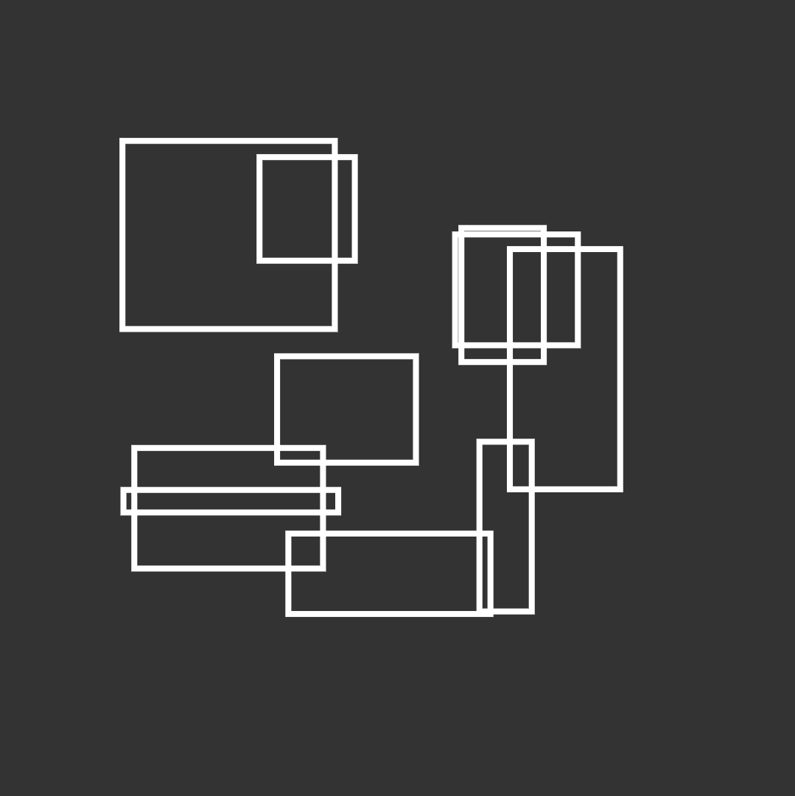

# Pragma Template

A starter template for creating generative artwork using [p5.js](https://p5js.org/)



Features:

- A simple framework
- Live reload on code changes
- Strong minification/compression
- Prints minfied bytes and approximate MATIC deploy cost on each reload
- A robust pseudo-random number generator and hashing function (`hash`)
- Utilities for color, math, random, and vector to get you started

## Install

Clone this repository, move into it, and install its dependencies

```bash
git clone https://github.com/pragma-art/pragma-template
cd pragma-template
npm install
```

## Usage

Run one of the following scripts in the same terminal

#### `npm run start`

Runs a development server on http://localhost:8081, where changing code in `src/` (or `www/index.html`) will automatically rebuild to `www/main.min.js` and then reload the page.

Hit `Ctrl + C` to quit the development server.

#### `npm run build`

Produces a final production build zip file to `project.zip`, giving byte and ETH cost stats.

## Source Structure

See `./src/` folder:

- `index.js` is the main entry point which sets up the p5.js rules
- `util/` is a folder that contains some example utilities (PRNG, color, math)

## License

[MIT](https://choosealicense.com/licenses/mit/)
